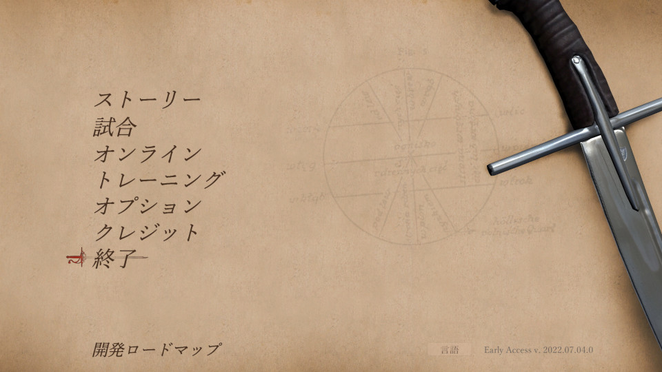
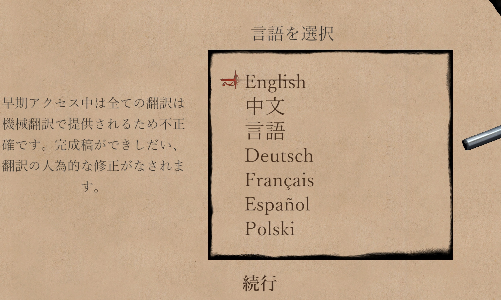

# Hellish Quart Japanese Translation Mod

[Hellish Quart](https://store.steampowered.com/app/1000360/Hellish_Quart/) のテキストを日本語化します

NOTE: The introduction is written in English at the end.

# 要件

* 64 bit Windows OS または Linux
	* Linuxの場合, protontricks を併用すれば動作します (後述).
* 最新の Steam版 Hellish Quart
	* Steam版のみ動作を確認しています. GOG版は持ってないので動作確認していません. 動作確認報告は歓迎します.

# インストール方法

* "[Releases](https://github.com/Gedevan-Aleksizde/HellishQuartJP/releases)" から最新の `HellishQuartJP-installer-{バージョン}-{HQ本体バージョン}.exe` または, ---`.zip`をダウンロードしてください. 
	* バージョンはなるべく最新のものを選んでください. 本体より少し古いバージョンのものをインストールしても一応動作することが多いです.
        * v.10.0 から [Nexus](https://www.nexusmods.com/hellishquart/mods/7)でも公開しました. 
* (EXE形式の場合) EXEファイルを実行してください. インストールフォルダは自動判定されますが, 必要に応じて Hellish Quart のインストールフォルダ (`Hellish Quart.exe` のある場所) に修正してください.
	* (GOG版のレジストリキーがわからないため, GOG版はおそらく手動でインストール先を指定する必要があります)
* (ZIP形式の場合) ZIPを解凍してHellish Quartのインストールフォルダ内に上書きしてください
* 2023年5月ごろのアップデートから, 本体にも日本語テキストが追加されましたが今のところ機械翻訳に放り投げただけっぽいので不正確です. このmodの日本語を表示させたい場合は, 言語選択で"English"になっていることを確認してください.

## Linux (たぶん Steam Deck も) の場合

MelonLoader を動作させるために追加で操作が必要かもしれません. ([詳細](https://melonwiki.xyz/#/README?id=linux-instructions))

1. Protontrick をインストールしていない場合, インストールしてください. 例えば Arch Linux 系なら, `yay -S protontricks` `yay -S protontricks-git` コマンドでできます.
    * それ以外の Linux ディストリビューションの場合は, flatpak でインストールするのが推奨されています (https://github.com/Matoking/protontricks)
1. `~/.local/share/Steam/steamapps/compatdata/1000360` を一度削除してから Hellish Quart を起動する
1. `protontricks 1000360 winecfg` を実行し, 出てきたウィンドウの下のほうにある項目から, Windows のバージョンを Windows 10 にする

もしうまく行かない場合, 以下のどちらかを実行すると動作するかもしれません

* `protontricks 1000360 --force vcrun2019`
* `protontricks 1000360 --force dotnet472`

* 1000360 というのは Hellish Quart の App ID です. 環境によって異なるということはないと思いますが, もし見つからなかったら `protontricks -s Hellish` で ID を確認してください.

# アンインストール方法

Hellish Quart インストールフォルダの

* `AutoTranslator` フォルダ
* `version.dll`

を削除してください. さらに他に MelonLoader に依存する modを使用していない場合は,

* `MelonLoader` フォルダ
* `UserData` フォルダ
* `Mods` フォルダ
* `NOTICE.txt`

も削除して下さい.

よくわからなかったら全ファイル消して Steam の「整合性の確認」で復元したほうが早いと思います.

# 技術的補足

* 配布プログラムは [MelonLoader](https://github.com/LavaGang/MelonLoader) および MelonLoader 版 [XUnity Auto Translator](https://github.com/bbepis/XUnity.AutoTranslator) (以下, XUAT), そして私が独自に作成した翻訳テキストの生成プログラムを同梱しているだけです
    * 翻訳機能の詳細は元プログラムのリンクを参照してください
    * よって既に MelonLoader や XUAT を使用しているなら, 足りないファイルを上書きするだけでも動作するはずです
    * ただし, MelonLoader はv0.5.4では動作しません. v0.5.3を使用してください
* 翻訳テキストのフォントは "Yu Mincho" (游明朝) を指定してますが, マシンにインストールされているフォントであれば他のものも使用できると思います. `AutoTranslator/Config.ini` の `OverrideFont` の項目を書き換えることで変更できます
* 現状ではフォントの大きさ調整ができないため, 文字が見切れてる箇所がいくらかあります
* 手動でビルドしたい場合, `make-installer.ps1` を実行すれば同じ構成のファイルが生成されるはずです
    * .NET とか Visual Studio とかが必要です
    * 現時点ではテキストは暗号化されています (ソースコードを読めば簡単に復号できます)
    * インストーラは Nullsoft Scriptable Install System を使用して作成しています
* コマンド解説等の記事もご覧ください: https://under-identified.hatenablog.com/entry/2021/05/04/184614

# Credits

* This program includes:
    * [Melonloader](https://github.com/LavaGang/MelonLoader) developed by Lava Gang, licensed under the Apache-2.0 license.
    * [Xunity Auto Translator](https://github.com/bbepis/XUnity.AutoTranslator), MIT licensed
* The original text rights belong to Kubold

# Requirements

* 64 bit Windows OS or Linux
    * If you use Linux OS, it may works with protontricks ([detail](https://melonwiki.xyz/#/README?id=linux-instructions))
* Latest Hellish Quart from Steam
    * I check only Steam version. I don't have GOG version

# How to install

Download  `HellishQuartJP-installer-v{VERSION}.exe` from [Releases](https://github.com/Gedevan-Aleksizde/HellishQuartJP/releases) and run.

# How to uninstall

delete the following files/folders in the Hellish Quart game folder:

* `AutoTranslator` folder
* `version.dll`

In addition, if you don't use any other mods which depend on MelonLoader, delte the following folders:

* `MelonLoader`
* `UserData`
* `Mods`
* `NOTICE.txt`

# Technical Notes:

* This mod is made of [MelonLoader](https://github.com/LavaGang/MelonLoader), [XUnity Auto Translator](https://github.com/bbepis/XUnity.AutoTranslator) and my translation files. The latter is my only attribution.
    * You can install MelonLoader and XUAT manually. If you already installed them, what you need is copy `AutoTranslator` folder into the game folder.
    * **Note**: the latest MelonLoader (v0.5.4) shouldn't work. install v0.5.3 insteadly if you want to install it manually.  
* Default font for translated text is "Yu Mincho" (游明朝, one of standard Japanese font family for Windows OS). You can change the font at `OverrideFont` field in `AutoTranslator/Config.ini` file.
* Some text may be trimmed because I can't change the size.
* If you want to build this mod by yourself, run `make-installer.ps1`. I create the installer by Nullsoft Scriptable Install System (NSIS)

# Credits

* This program includes:
    * [Melonloader](https://github.com/LavaGang/MelonLoader) developed by Lava Gang, licensed under the Apache-2.0 license.
    * [Xunity Auto Translator](https://github.com/bbepis/XUnity.AutoTranslator), MIT licensed
* The original text rights belong to Kubold

# **I wish official support for localization**
